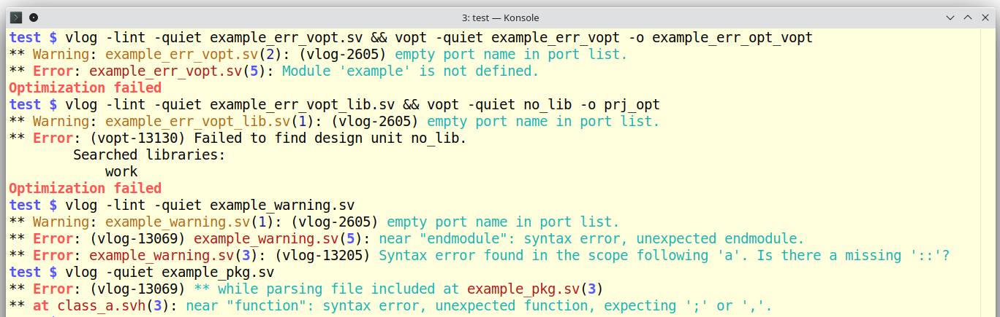

# Color QuestaSim (colorquestasim)

A wrapper for colorizing the output of Mentor Graphics QuestaSim messages.
The script also allows you to hide some QuestaSim messages (such as: Copyright, Loading Libs,
running command, start time, UVM relnotes, UVM packages load).



## Table of Contents

1. [Installation](#installation)
2. [Configuration](#configuration)
3. [Usage](#usage)
   3.1. [Common](#common)
   3.2. [Get Script Version](#get-script-version)
4. [Known Issues](#known-issues)
5. [Reference](#reference)

## Installation

Supported OS: Linux, Windows (MinGW)

1. Copy the [colorquestasim.pl](colorquestasim.pl) file to a directory of your choice.
2. Create symbolic links pointing to `colorquestasim.pl`. Name these links the same as the
QuestaSim command names. Place these links in a directory that is included in your `$PATH`
environment variable **before** the directory containing the actual QuestaSim commands.

### Example installation for Linux

```bash
cp colorquestasim.pl ~/bin/
cd ~/bin
ln -s colorquestasim.pl vlog
ln -s colorquestasim.pl vopt
ln -s colorquestasim.pl vsim
export PATH="$HOME/bin:$PATH"
```

### Example installation for Windows (MinGW)

```bash
cp colorquestasim.pl ~/bin/vlog
cp colorquestasim.pl ~/bin/vopt
cp colorquestasim.pl ~/bin/vsim
export PATH="$HOME/bin:$PATH"
```

## Configuration

You can override the default settings by creating a configuration file named `~/.colorquestasim`
or `~/.colorquestasim_<os_type>`. For more information on available settings, refer to the
comments in the [colorquestasim.txt](colorquestasim.txt) sample file.

## Usage

### Common

Use the QuestaSim `vlog`, `vopt`, or `vsim` commands as you normally would. The `colorquestasim`
wrapper will automatically colorize the output.

### Get Script Version

To get the version of the script, run:

```bash
<vlog/vopt/vsim> --version
```

Replace `<vlog/vopt/vsim>` with the corresponding symlink created during the installation of the
script (e.g., `vlog`, `vopt`, or `vsim`).

## Known Issues

For a list of known issues with QuestaSim version 10.7c on Windows OS (MinGW), see the
[Issues for QuestaSim version 10.7c on Window OS (MinGW)](issues_questasim10c7_mingw.md)

## Reference
This project was inspired by [colorgcc](https://github.com/colorgcc/colorgcc).
